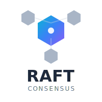

<div align="center">
  

  <h1>RAFT</h1>
  <p><strong>Production-ready Raft consensus implementation for Node.js</strong></p>

  <p>
    <a href="https://www.npmjs.com/package/@usex/raft"></a>
    <a href="https://github.com/ali-master/raft/blob/master/LICENSE"></a>
    <a href="https://www.npmjs.com/package/@usex/raft"></a>
    <a href="https://github.com/ali-master/raft"></a>
  </p>

  <p>
    <a href="#-quick-start">Quick Start</a> •
    <a href="./docs/getting-started.md">Documentation</a> •
    <a href="./docs/examples.md">Examples</a> •
    <a href="#-why-raft">Why RAFT?</a>
  </p>
</div>

---

> ⚠️ **Note**: This library is under active development and not yet released. Star the repo to get notified!

## 🎯 What is RAFT?

RAFT is a battle-tested implementation of the [Raft consensus algorithm](https://raft.github.io/) for Node.js, designed to help you build bulletproof distributed systems. Whether you're building a distributed database, configuration service, or any system requiring strong consistency across multiple nodes, RAFT has you covered.

## ✨ Key Features

### 🏗️ Core Capabilities
- **🔄 Consensus Algorithm** - Implements the Raft consensus algorithm for distributed systems
- **🎯 Complete Raft Implementation** - Leader election, log replication, and membership changes
- **🛡️ Production-Ready** - Built for reliability, performance, and observability
- **💾 Redis-Backed Storage** - Persistent state management and peer discovery
- **🎲 Weighted Voting** - Advanced leader election with configurable weights
- **🔄 Dynamic Membership** - Add or remove nodes without downtime

### 🔧 Reliability & Performance
- **⚡ High Availability** - Automatic failover and leader election
- **🔄 Log Replication** - Efficient log replication with strong consistency
- **🔄 Membership Changes** - Dynamic cluster membership management
- **🔄 Snapshotting** - Periodic snapshots for efficient state management
- **🔄 Append-Only Log** - Durable, append-only log for all operations
- **🔌 Circuit Breakers** - Fault tolerance for network operations
- **📊 Comprehensive Monitoring** - Prometheus metrics and detailed logging
- **📝 Write-Ahead Logging** - Durable log storage with automatic recovery
- **🔍 Peer Discovery** - Automatic peer discovery and health checking
- **📈 High Throughput** - Optimized for low-latency operations and high throughput
- **🔄 Automatic Failover** - Seamless leader election and failover handling
- **🛡️ Split-Brain Prevention** - Mechanisms to prevent data inconsistency during network partitions
- **🔒 Security Features** - TLS support, authentication, and access control
- **📦 Modular Design** - Easily extendable with custom plugins and middleware
- **🔄 Event-Driven** - Rich event system for state monitoring and custom actions
- **📦 TypeScript Support** - Full type safety and IntelliSense for a better developer experience
- **🔗 Easy Integration** - Simple API for Node.js and NestJS applications
- **📚 Extensive Documentation** - Comprehensive guides, examples, and API references
- **🌐 Cross-Platform** - Works seamlessly on Linux, macOS, and Windows
- **🔄 Multi-Node Clusters** - Supports clusters of any size with automatic scaling
- **🔄 Real-Time Updates** - Push updates to clients in real-time using WebSockets or HTTP/2
- **🔄 Customizable** - Easily configure timeouts, retry policies, and other parameters

### 🚀 Developer Experience
- **📡 Event-Driven Architecture** - Rich event system for state monitoring
- **📘 TypeScript First** - Full type safety and IntelliSense support
- **🔧 Easy Integration** - Simple API for Node.js and NestJS
- **📚 Extensive Documentation** - Comprehensive guides and examples

## 🚦 Quick Start

### Installation

```bash
# npm
npm install @usex/raft

# yarn
yarn add @usex/raft

# pnpm
pnpm add @usex/raft
```

### Basic Usage

```typescript
import { RaftEngine } from '@usex/raft';

// 1. Initialize the engine
const engine = new RaftEngine();

// 2. Create a node
const config = RaftEngine.createDefaultConfiguration('node1', 'my-cluster');
const node = await engine.createNode(config);

// 3. Start the node
await engine.startNode('node1');

// 4. Listen for events
node.on('stateChange', ({ state, term }) => {
  console.log(`Node is now ${state} for term ${term}`);
});

// 5. Write data (if leader)
if (node.isLeader()) {
  await node.appendLog({
    command: 'SET',
    key: 'user:123',
    value: { name: 'Alice', role: 'admin' }
  });
}
```

## 💡 Why RAFT?

### 🎯 Perfect For
- **Distributed Databases** - Build consistent, replicated data stores
- **Configuration Services** - Manage distributed configuration with strong consistency
- **Service Discovery** - Implement reliable service registries
- **Distributed Locks** - Create distributed locking mechanisms
- **Leader Election** - Coordinate distributed services
- **State Machines** - Implement replicated state machines
- **Event Sourcing** - Build event-driven architectures with strong consistency
- **Microservices** - Ensure reliable communication and state management across services
- **Real-Time Applications** - Maintain consistent state in real-time systems
- **IoT Systems** - Manage distributed IoT devices with strong consistency
- **Gaming Servers** - Implement leaderboards and game state management
- **Blockchain Applications** - Build consensus mechanisms for blockchain networks
- **Financial Systems** - Ensure transaction consistency in distributed financial applications
- **Data Replication** - Replicate data across multiple nodes for high availability
- **Analytics Platforms** - Maintain consistent state in distributed analytics systems
- **Content Delivery Networks (CDNs)** - Ensure consistent content across distributed nodes
- **Search Engines** - Implement distributed search with strong consistency
- **Machine Learning Systems** - Manage distributed model training and inference
- **Cloud Services** - Build reliable cloud-native applications with strong consistency
- **Edge Computing** - Ensure consistent state across edge devices
- **API Gateways** - Implement consistent routing and state management
- **Message Brokers** - Build reliable message delivery systems
- **Data Warehousing** - Ensure consistent data across distributed data warehouses
- **Backup and Recovery** - Implement reliable backup and recovery mechanisms

### 🛡️ Battle-Tested Features
- **Automatic Failover** - Seamless leader election when nodes fail
- **Split-Brain Prevention** - Built-in mechanisms to prevent data inconsistency
- **Network Partition Handling** - Graceful handling of network splits
- **Data Consistency** - Strong consistency guarantees across all nodes

## 📖 Documentation

### 🏃 Getting Started
- [**Installation Guide**](./docs/installation.md) - Setup instructions and requirements
- [**Quick Start Tutorial**](./docs/getting-started.md) - Build your first RAFT cluster
- [**Configuration**](./docs/configuration.md) - Customize RAFT for your needs

### 📚 Core Concepts
- [**Architecture**](./docs/architecture.md) - How RAFT works under the hood
- [**API Reference**](./docs/api-reference.md) - Complete API documentation
- [**Examples**](./docs/examples.md) - Real-world use cases and patterns

### 🔬 Advanced Topics
- [**Advanced Usage**](./docs/advanced-usage.md) - Complex scenarios and optimizations
- [**Monitoring**](./docs/monitoring.md) - Metrics, observability, and debugging
- [**Deployment**](./docs/deployment.md) - Production deployment best practices
- [**Security**](./docs/security.md) - Securing your RAFT cluster

### 🛠️ Troubleshooting
- [**Common Issues**](./docs/troubleshooting.md) - Solutions to frequent problems
- [**Migration Guide**](./docs/migration-guide.md) - Upgrading between versions

## 💻 System Requirements

- **Node.js** >= 18.12.0
- **Redis** >= 6.0
- **TypeScript** >= 5.0 (for TypeScript projects)

## 🎮 Interactive Example

Want to see RAFT in action? Check out our interactive examples:

### Three-Node Cluster Example
```typescript
// Node 1 - Initial Leader
const node1 = await createNode('node1', { weight: 3 });

// Node 2 & 3 - Followers
const node2 = await createNode('node2', { weight: 2 });
const node3 = await createNode('node3', { weight: 1 });

// Simulate leader failure
await node1.stop();
// Node 2 becomes leader due to higher weight!
```

[**See More Examples →**](./docs/examples.md)

## 🤝 Contributing

We love contributions! Whether it's:
- 🐛 Bug fixes
- ✨ New features
- 📚 Documentation improvements
- 💡 Ideas and suggestions

Check out our [Contributing Guide](./CODE_OF_CONDUCT.md) to get started.

## 📊 Performance

RAFT is designed for high performance:
- **< 50ms** leader election in typical scenarios
- **10,000+ ops/sec** throughput on commodity hardware
- **Minimal memory footprint** with efficient state management

## 🛡️ Security

- **TLS Support** - Encrypted communication between nodes
- **Authentication** - Built-in node authentication
- **Access Control** - Fine-grained permissions for operations

[**Learn more about security →**](./docs/security.md)

## 📱 Community & Support

- 💬 **GitHub Discussions** - [Ask questions and share ideas](https://github.com/ali-master/raft/discussions)
- 🐛 **GitHub Issues** - [Report bugs or request features](https://github.com/ali-master/raft/issues)
- 📖 **Documentation** - [Comprehensive guides and API docs](./docs/)
- 🌟 **Star us on GitHub** - Show your support!

## 📜 License

This project is licensed under the MIT License. See the [LICENCE](./LICENCE) file for details.

---

<div align="center">
  <p>
    <strong>Ready to build distributed systems that just work?</strong>
  </p>
  <p>
    <a href="./docs/installation.md">🚀 Get Started</a> •
    <a href="./docs/examples.md">📚 View Examples</a> •
    <a href="https://github.com/ali-master/raft">⭐ Star on GitHub</a>
  </p>
  <p>
    Made with ❤️ by <a href="https://github.com/ali-master">Ali Master</a> and the open source community.
  </p>
</div>
