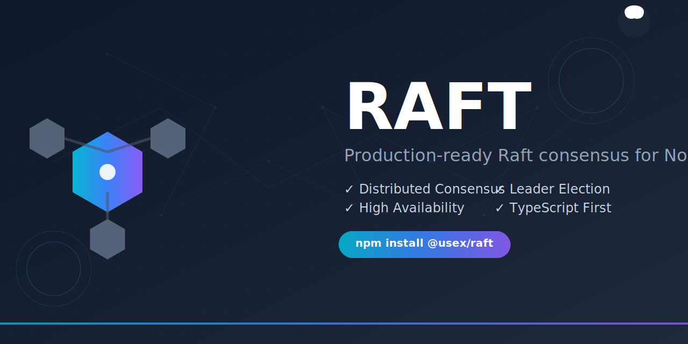

# RAFT Brand Assets

A comprehensive collection of brand assets for the RAFT distributed consensus library.

## 📋 Table of Contents

- [Logos](#-logos)
- [Colors](#-colors)
- [Typography](#-typography)
- [Usage Guidelines](#-usage-guidelines)
- [Asset Downloads](#-asset-downloads)
- [Social Media Assets](#-social-media-assets)
- [Contact](#-contact)

## 🎨 Logos

### Primary Logo Collection

We provide multiple logo variations to suit different use cases and backgrounds:

| Logo | Description | Best Use |
|------|-------------|----------|
|  | **Primary Logo** - Clean hexagonal design representing distributed nodes | Websites, documentation, presentations |
|  | **Creative Logo** - Artistic raft metaphor with flowing elements | Marketing materials, blog posts |
|  | **Network Logo** - Traditional network topology visualization | Technical documentation, diagrams |
|  | **Abstract Logo** - Dynamic geometric design with energy flow | Modern applications, tech conferences |

### Logo Specifications

- **Format**: SVG (scalable vector graphics)
- **Minimum Size**: 32x32px
- **Maximum Size**: Unlimited (vector format)
- **Recommended Sizes**: 150x150px, 300x300px, 512x512px

## 🎨 Colors

### Primary Color Palette

Our brand uses a modern, tech-forward color scheme that conveys reliability and innovation:

| Color | Hex Code | RGB | Usage |
|-------|----------|-----|-------|
| **Primary Blue** | `#3b82f6` | `59, 130, 246` | Primary branding, CTAs, links |
| **Deep Blue** | `#1d4ed8` | `29, 78, 216` | Accents, gradients |
| **Purple** | `#8b5cf6` | `139, 92, 246` | Highlights, gradients |
| **Cyan** | `#06b6d4` | `6, 182, 212` | Success states, highlights |
| **Orange** | `#f97316` | `249, 115, 22` | Warnings, energy elements |

### Secondary Colors

| Color | Hex Code | RGB | Usage |
|-------|----------|-----|-------|
| **Dark Gray** | `#1e293b` | `30, 41, 59` | Text, backgrounds |
| **Medium Gray** | `#64748b` | `100, 116, 139` | Secondary text |
| **Light Gray** | `#94a3b8` | `148, 163, 184` | Borders, dividers |
| **White** | `#ffffff` | `255, 255, 255` | Backgrounds, text on dark |

### Gradient Combinations

```css
/* Primary Gradient */
background: linear-gradient(135deg, #06b6d4 0%, #3b82f6 50%, #8b5cf6 100%);

/* Sunset Gradient (Creative Logo) */
background: linear-gradient(135deg, #f97316 0%, #ec4899 33%, #8b5cf6 66%, #6366f1 100%);

/* Dark Gradient */
background: linear-gradient(135deg, #0f172a 0%, #1e293b 100%);
```

## 📝 Typography

### Recommended Fonts

**Primary Font Stack:**
```css
font-family: -apple-system, BlinkMacSystemFont, 'Segoe UI', 'Roboto', sans-serif;
```

**Headings:**
- **Font Weight**: 700-800 (Bold/ExtraBold)
- **Letter Spacing**: Normal to -0.025em

**Body Text:**
- **Font Weight**: 400 (Regular)
- **Line Height**: 1.6

**Code/Technical:**
```css
font-family: 'SF Mono', 'Monaco', 'Inconsolata', 'Roboto Mono', monospace;
```

## 📏 Usage Guidelines

### Logo Usage

#### ✅ **DO:**
- Maintain adequate clear space around the logo (minimum 32px)
- Use on contrasting backgrounds for optimal readability
- Scale proportionally when resizing
- Use provided color versions on appropriate backgrounds
- Download high-resolution versions for print materials

#### ❌ **DON'T:**
- Distort or stretch the logo
- Change the colors outside the brand palette
- Place on busy or low-contrast backgrounds
- Recreate or modify the logo elements
- Use pixelated or low-resolution versions

### Clear Space Requirements

Maintain a minimum clear space around all logos equal to the height of the "R" in "RAFT" in the logo.

### Background Usage

| Background | Recommended Logo |
|------------|------------------|
| Light backgrounds (#ffffff, #f8fafc) | Primary colored logos |
| Dark backgrounds (#1e293b, #0f172a) | White/light versions |
| Colored backgrounds | High contrast versions |
| Photography/complex imagery | White logo with subtle shadow |

## 📥 Asset Downloads

### Logo Formats Available

- **SVG**: Perfect for web use, scalable
- **PNG**: High-resolution raster format
- **PDF**: Vector format for print
- **ICO**: Favicon format for websites

### Sizes Available

- **Favicon**: 16x16px, 32x32px, 48x48px
- **Web**: 150x150px, 300x300px
- **Social**: 512x512px, 1024x1024px
- **Print**: Vector formats (SVG, PDF)

## 📱 Social Media Assets

### Social Media Preview



**Specifications:**
- **Size**: 1280x640px (2:1 ratio)
- **Format**: SVG/PNG
- **Usage**: Open Graph, Twitter Cards, LinkedIn sharing

### Platform-Specific Recommendations

| Platform | Size | Format | Notes |
|----------|------|--------|-------|
| **GitHub** | 1280x640px | PNG/SVG | Repository social preview |
| **Twitter/X** | 1200x675px | PNG | Cards and headers |
| **LinkedIn** | 1200x627px | PNG | Post sharing |
| **Discord** | 1280x640px | PNG | Server/embed previews |
| **Dev.to** | 1000x420px | PNG | Article covers |

## 🎯 Brand Voice & Messaging

### Key Brand Attributes
- **Reliable**: Production-ready, battle-tested
- **Modern**: TypeScript-first, cutting-edge
- **Developer-Friendly**: Comprehensive docs, great DX
- **Professional**: Enterprise-grade quality

### Messaging Framework
- **Tagline**: "Production-ready Raft consensus for Node.js"
- **Value Proposition**: "Build bulletproof distributed systems"
- **Technical Focus**: Consensus, reliability, fault tolerance

## 🚀 Examples in Use

### Website Header
```html
<header>
  
  <h1>RAFT</h1>
  <p>Production-ready Raft consensus implementation for Node.js</p>
</header>
```

### Social Meta Tags
```html
<meta property="og:image" content="./assets/social-preview.svg" />
<meta property="og:title" content="RAFT - Production-ready Consensus for Node.js" />
<meta property="og:description" content="Build bulletproof distributed systems with leader election, fault tolerance & TypeScript support." />
```

## 🤝 License & Usage Rights

All brand assets are provided under the same license as the RAFT library (MIT License). You may use these assets when:

- Creating content about RAFT
- Building applications that use RAFT
- Writing tutorials or documentation
- Speaking at conferences about RAFT

### Attribution

When using RAFT brand assets, please provide appropriate attribution:
```
"RAFT logo and brand assets © RAFT Team"
```

## 📞 Contact

For brand-related questions or custom asset requests:

- **GitHub Issues**: [Report brand issues](https://github.com/ali-master/raft/issues)
- **Discussions**: [Brand feedback](https://github.com/ali-master/raft/discussions)
- **Documentation**: [Brand guidelines](./BRAND_ASSETS.md)

---

*Last updated: June 02, 2025*
*Version: 1.0.0*

**Made with ❤️ by [Ali Torki](https://github.com/ali-master)**
