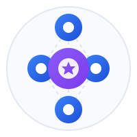

<div align="center">
  

  <h3>Production-Ready Raft Consensus for Node.js</h3>

  <p>Build fault-tolerant distributed systems with leader election, data replication, and automatic failover.</p>

  [](https://badge.fury.io/js/%40usex%2Fraft)
  [](https://opensource.org/licenses/MIT)
  [](https://nodejs.org)
  [](https://www.typescriptlang.org/)
  []()
</div>

## ✨ Features

- **🚀 Production-Ready**: Battle-tested implementation of the Raft consensus algorithm
- **🔒 Fault Tolerant**: Automatic leader election and failover handling
- **📊 Observable**: Built-in metrics with Prometheus integration
- **🔄 Circuit Breaker**: Resilient RPC communication with automatic recovery
- **📝 Persistent State**: Redis-backed storage for durability across restarts
- **🎯 Type-Safe**: Full TypeScript support with comprehensive type definitions
- **🧪 Well-Tested**: Extensive test coverage including chaos testing
- **📦 Lightweight**: Minimal dependencies, optimized for performance
- **🔌 Extensible**: Event-driven architecture for custom integrations

## 📚 Table of Contents

- [Installation](#-installation)
- [Quick Start](#-quick-start)
- [Core Concepts](#-core-concepts)
- [API Reference](#-api-reference)
- [Configuration](#-configuration)
- [Examples](#-examples)
- [Events](#-events)
- [Metrics](#-metrics)
- [Testing](#-testing)
- [Contributing](#-contributing)
- [License](#-license)

## 📦 Installation

```bash
npm install @usex/raft
# or
yarn add @usex/raft
# or
pnpm add @usex/raft
```

### Peer Dependencies

```bash
npm install ioredis opossum prom-client
```

## 🚀 Quick Start

```typescript
import { RaftEngine, RaftState, LogLevel } from '@usex/raft';

// Create the Raft engine
const engine = new RaftEngine();

// Create a Raft node
const node = await engine.createNode({
  nodeId: 'node-1',
  clusterId: 'my-cluster',
  peers: ['node-2', 'node-3'],
  storageAdapter: {
    type: 'redis',
    host: 'localhost',
    port: 6379,
  },
  logger: {
    level: LogLevel.INFO,
  },
});

// Listen to state changes
node.on('state-change', ({ from, to }) => {
  console.log(`Node transitioned from ${from} to ${to}`);
});

// Listen for leader election
node.on('leader-elected', ({ leaderId }) => {
  console.log(`New leader elected: ${leaderId}`);
});

// Start the node
await node.start();

// Propose a value (only works on leader)
if (node.getState() === RaftState.LEADER) {
  await node.propose({
    type: 'set',
    key: 'counter',
    value: 1
  });
}
```

## 🎯 Core Concepts

### Raft Algorithm

Raft is a consensus algorithm designed to be understandable. It ensures that multiple nodes in a distributed system agree on values even in the presence of failures.

#### Key Components:

1. **Leader Election**: Nodes elect a leader to manage the cluster
2. **Log Replication**: The leader replicates its log to all followers
3. **Safety**: Ensures consistency across all nodes
4. **Membership Changes**: Dynamically add or remove nodes

### Node States

```typescript
enum RaftState {
  FOLLOWER = 'follower',
  CANDIDATE = 'candidate',
  LEADER = 'leader',
}
```

- **Follower**: Default state, receives updates from the leader
- **Candidate**: Temporary state during leader election
- **Leader**: Manages the cluster and handles client requests

### Architecture

```
┌─────────────┐     ┌─────────────┐     ┌─────────────┐
│   Node 1    │     │   Node 2    │     │   Node 3    │
│  (Leader)   │────▶│ (Follower)  │────▶│ (Follower)  │
└─────────────┘     └─────────────┘     └─────────────┘
       │                    │                    │
       └────────────────────┴────────────────────┘
                     Redis Storage
```

## 📖 API Reference

### RaftEngine

The main entry point for creating and managing Raft nodes.

```typescript
class RaftEngine {
  // Create a new Raft node
  async createNode(config: RaftConfiguration): Promise<RaftNode>;

  // Get a node by ID
  getNode(nodeId: string): RaftNode | undefined;

  // Get all nodes
  getAllNodes(): Map<string, RaftNode>;

  // Remove a node
  async removeNode(nodeId: string): Promise<void>;

  // Create default configuration
  static createDefaultConfiguration(
    nodeId: string,
    clusterId: string
  ): RaftConfiguration;
}
```

### RaftNode

The core Raft node implementation.

```typescript
class RaftNode extends EventEmitter {
  // Lifecycle methods
  async start(): Promise<void>;
  async stop(): Promise<void>;

  // State management
  getState(): RaftState;
  getLeaderId(): string | null;
  getCurrentTerm(): number;

  // Cluster operations
  async propose(data: any): Promise<void>;
  async addPeer(peerId: string): Promise<void>;
  async removePeer(peerId: string): Promise<void>;
  getPeers(): string[];

  // Utilities
  async forceElection(): Promise<void>;
  async createSnapshot(): Promise<void>;
  getMetrics(): RaftMetrics;
}
```

## ⚙️ Configuration

### Basic Configuration

```typescript
const config: RaftConfiguration = {
  // Required
  nodeId: 'node-1',
  clusterId: 'my-cluster',

  // Network
  host: '0.0.0.0',
  port: 3000,
  peers: ['node-2:3001', 'node-3:3002'],

  // Timing (in ms)
  electionTimeout: [150, 300],
  heartbeatInterval: 50,
  rpcTimeout: 100,

  // Storage
  storageAdapter: {
    type: 'redis',
    host: 'localhost',
    port: 6379,
    password: 'optional',
    keyPrefix: 'raft:',
  },

  // Advanced
  maxLogEntries: 1000,
  snapshotInterval: 100,

  // Logging
  logger: {
    level: LogLevel.INFO,
    formatter: 'json',
  },
};
```

### Environment Variables

```bash
# Node configuration
RAFT_NODE_ID=node-1
RAFT_CLUSTER_ID=my-cluster
RAFT_HOST=0.0.0.0
RAFT_PORT=3000

# Redis configuration
REDIS_HOST=localhost
REDIS_PORT=6379
REDIS_PASSWORD=secret

# Logging
LOG_LEVEL=info
```

## 💡 Examples

### Building a Distributed Cache

```typescript
import { RaftEngine, RaftState } from '@usex/raft';

class DistributedCache {
  private engine: RaftEngine;
  private cache: Map<string, any> = new Map();

  async initialize(nodeId: string, peers: string[]) {
    this.engine = new RaftEngine();

    const node = await this.engine.createNode({
      nodeId,
      clusterId: 'cache-cluster',
      peers,
    });

    // Apply committed entries to local cache
    node.on('log-committed', (entry) => {
      if (entry.data.type === 'set') {
        this.cache.set(entry.data.key, entry.data.value);
      } else if (entry.data.type === 'delete') {
        this.cache.delete(entry.data.key);
      }
    });

    await node.start();
    return node;
  }

  async set(key: string, value: any) {
    const node = this.engine.getAllNodes().values().next().value;
    if (node?.getState() === RaftState.LEADER) {
      await node.propose({ type: 'set', key, value });
    } else {
      throw new Error('Not the leader');
    }
  }

  get(key: string) {
    return this.cache.get(key);
  }
}
```

### Multi-Node Setup

```typescript
// Node 1 (Initial Leader)
const node1 = await engine.createNode({
  nodeId: 'node-1',
  clusterId: 'my-cluster',
  port: 3001,
  peers: [],
});

// Node 2
const node2 = await engine.createNode({
  nodeId: 'node-2',
  clusterId: 'my-cluster',
  port: 3002,
  peers: ['node-1:3001'],
});

// Node 3
const node3 = await engine.createNode({
  nodeId: 'node-3',
  clusterId: 'my-cluster',
  port: 3003,
  peers: ['node-1:3001', 'node-2:3002'],
});

// Start all nodes
await Promise.all([
  node1.start(),
  node2.start(),
  node3.start(),
]);
```

## 📡 Events

The RaftNode emits various events for monitoring and integration:

```typescript
// State transitions
node.on('state-change', ({ from, to }) => {
  console.log(`State changed: ${from} → ${to}`);
});

// Leader election
node.on('leader-elected', ({ leaderId, term }) => {
  console.log(`Leader elected: ${leaderId} for term ${term}`);
});

// Log replication
node.on('log-replicated', (entry) => {
  console.log('Log entry replicated:', entry);
});

node.on('log-committed', (entry) => {
  console.log('Log entry committed:', entry);
});

// Peer management
node.on('peer-added', ({ peerId }) => {
  console.log(`Peer added: ${peerId}`);
});

node.on('peer-removed', ({ peerId }) => {
  console.log(`Peer removed: ${peerId}`);
});

// Errors
node.on('error', (error) => {
  console.error('Raft error:', error);
});
```

### Complete Event List

| Event | Description | Payload |
|-------|-------------|---------|
| `state-change` | Node state transition | `{ from, to }` |
| `leader-elected` | New leader elected | `{ leaderId, term }` |
| `leader-lost` | Leader lost connection | `{ nodeId }` |
| `term-started` | New term started | `{ term }` |
| `vote-requested` | Vote request received | `{ candidateId, term }` |
| `vote-granted` | Vote granted to candidate | `{ candidateId, term }` |
| `vote-denied` | Vote denied to candidate | `{ candidateId, term, reason }` |
| `log-appended` | Entry appended to log | `{ entry }` |
| `log-replicated` | Entry replicated to followers | `{ entry }` |
| `log-committed` | Entry committed | `{ entry, index }` |
| `snapshot-created` | Snapshot created | `{ index, term }` |
| `snapshot-restored` | Snapshot restored | `{ index, term }` |
| `peer-added` | Peer added to cluster | `{ peerId }` |
| `peer-removed` | Peer removed from cluster | `{ peerId }` |
| `error` | Error occurred | `{ error, context }` |

## 📊 Metrics

Built-in Prometheus metrics for monitoring:

```typescript
const metrics = node.getMetrics();

// Available metrics:
// - raft_state (current node state)
// - raft_term (current term)
// - raft_commit_index (last committed index)
// - raft_last_applied (last applied index)
// - raft_leader_changes_total (leader change count)
// - raft_votes_granted_total (votes granted)
// - raft_votes_denied_total (votes denied)
// - raft_rpc_requests_total (RPC requests)
// - raft_rpc_errors_total (RPC errors)
// - raft_rpc_duration_seconds (RPC latency)
```

### Prometheus Integration

```typescript
import { register } from 'prom-client';
import express from 'express';

const app = express();

app.get('/metrics', async (req, res) => {
  res.set('Content-Type', register.contentType);
  res.end(await register.metrics());
});
```

## 🧪 Testing

### Unit Tests

```bash
# Run all tests
pnpm test

# Watch mode
pnpm test:watch

# Coverage
pnpm test:coverage

# UI mode
pnpm test:ui
```

### Integration Testing

```typescript
import { RaftEngine } from '@usex/raft';
import { setupRedisContainer } from './test/utils';

describe('Raft Integration', () => {
  let redisContext;

  beforeAll(async () => {
    redisContext = await setupRedisContainer();
  });

  afterAll(async () => {
    await redisContext.container.stop();
  });

  it('should elect a leader', async () => {
    const engine = new RaftEngine();
    const nodes = await Promise.all([
      engine.createNode({ nodeId: 'node-1', clusterId: 'test' }),
      engine.createNode({ nodeId: 'node-2', clusterId: 'test' }),
      engine.createNode({ nodeId: 'node-3', clusterId: 'test' }),
    ]);

    await Promise.all(nodes.map(n => n.start()));

    // Wait for leader election
    await new Promise(resolve => setTimeout(resolve, 1000));

    const leaders = nodes.filter(n => n.getState() === 'leader');
    expect(leaders).toHaveLength(1);
  });
});
```

## 🤝 Contributing

We welcome contributions! Please see our [Contributing Guide](../../CONTRIBUTING.md) for details.

### Development Setup

```bash
# Clone the repository
git clone https://github.com/ali-master/raft.git
cd raft/packages/raft

# Install dependencies
pnpm install

# Run tests
pnpm test

# Build
pnpm build
```

## 📄 License

MIT © [Ali Torki](https://github.com/ali-master)

## 🔗 Links

- [GitHub Repository](https://github.com/ali-master/raft)
- [NPM Package](https://www.npmjs.com/package/@usex/raft)
- [Documentation](https://github.com/ali-master/raft/tree/main/docs)
- [Examples](https://github.com/ali-master/raft/tree/main/examples)

---

<div align="center">
  <p>Built with ❤️ by <a href="https://github.com/ali-master" target="_blank">Ali Master</a> and the open source community.</p>
  <p>
    <a href="https://github.com/ali-master/raft/stargazers">⭐ Star us on GitHub</a>
  </p>
</div>
