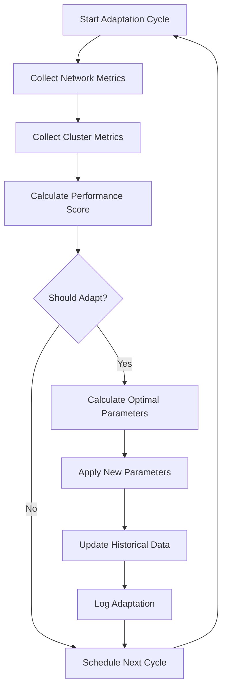

# Adaptive Consensus Algorithms

## Overview

The Adaptive Consensus Algorithms feature provides machine learning-inspired mechanisms to dynamically optimize Raft consensus parameters based on real-time cluster conditions. This advanced capability enables the system to automatically tune performance parameters to maintain optimal throughput and reliability under varying network conditions and workloads.

## Table of Contents

- [Motivation](#motivation)
- [How It Works](#how-it-works)
- [Configuration](#configuration)
- [Implementation Details](#implementation-details)
- [Performance Metrics](#performance-metrics)
- [API Reference](#api-reference)
- [Examples](#examples)
- [Best Practices](#best-practices)
- [Troubleshooting](#troubleshooting)

## Motivation

Traditional Raft implementations use static configuration parameters that are set once during cluster initialization. While this approach works well for stable environments, it can lead to suboptimal performance in dynamic conditions:

- **Network Variability**: Latency, bandwidth, and reliability can change over time
- **Load Fluctuations**: Application workload patterns vary throughout the day
- **Infrastructure Changes**: Adding/removing nodes affects optimal parameters
- **Geographic Distribution**: Multi-region deployments require different tuning

The Adaptive Consensus feature addresses these challenges by:

1. **Continuous Monitoring**: Real-time collection of network and cluster performance metrics
2. **Intelligent Analysis**: Machine learning algorithms to identify optimization opportunities
3. **Dynamic Adjustment**: Automatic parameter tuning without manual intervention
4. **Performance Learning**: Historical data analysis to improve future decisions

## How It Works

### 1. Metrics Collection

The system continuously monitors several key metrics:

#### Network Quality Metrics
- **Average Latency**: Round-trip time between cluster nodes
- **Packet Loss**: Percentage of failed network communications
- **Throughput**: Operations per second capacity
- **Jitter**: Variation in network latency

#### Cluster Performance Metrics
- **Leader Elections**: Frequency of leadership changes
- **Log Replication Latency**: Time to replicate entries across followers
- **Consensus Time**: Duration to achieve consensus on operations
- **Failure Rate**: Percentage of failed operations

### 2. Performance Scoring

A composite performance score (0-1) is calculated using weighted factors:

```
Performance Score = (
  NetworkScore * networkQualityWeight +
  ClusterScore * (throughputWeight + stabilityWeight)
) / (networkQualityWeight + throughputWeight + stabilityWeight)
```

Where:
- **NetworkScore**: Composite of latency, throughput, and packet loss metrics
- **ClusterScore**: Composite of replication, consensus, and stability metrics

### 3. Adaptation Decision

The algorithm decides to adapt parameters based on:

- **Performance Decline**: Three consecutive decreases in performance score
- **Threshold Violations**: Metrics exceeding configured thresholds
- **Stability Issues**: High frequency of leader elections

### 4. Parameter Optimization

When adaptation is triggered, the algorithm calculates optimal values for:

#### Election Timeout
- Adjusted based on network latency
- Higher latency → longer timeouts (reduce false elections)
- Lower latency → shorter timeouts (faster recovery)

#### Heartbeat Interval
- Adapted to network conditions
- Poor network → longer intervals (reduce overhead)
- Good network → shorter intervals (faster failure detection)

#### Batch Size
- Optimized for throughput
- High throughput capacity → larger batches
- Limited capacity → smaller batches

#### Replication Timeout
- Based on observed replication latency
- Prevents premature timeouts while maintaining responsiveness

### 5. Learning and Memory

The system maintains historical data to improve future decisions:

- **Parameter Effectiveness**: Tracks which parameters led to better performance
- **Pattern Recognition**: Identifies recurring patterns in workload and network conditions
- **Gradual Adaptation**: Uses configurable learning rate for smooth transitions

## Configuration

### Basic Configuration

```typescript
interface AdaptiveConsensusConfig {
  enabled: boolean;                    // Enable/disable the feature
  adaptationInterval: number;          // How often to adapt (ms)
  latencyThreshold: number;           // Network latency threshold (ms)
  throughputThreshold: number;        // Operations per second threshold
  learningRate: number;               // How aggressively to adapt (0-1)
  minElectionTimeout: number;         // Minimum election timeout (ms)
  maxElectionTimeout: number;         // Maximum election timeout (ms)
  minHeartbeatInterval: number;       // Minimum heartbeat interval (ms)
  maxHeartbeatInterval: number;       // Maximum heartbeat interval (ms)
  networkQualityWeight: number;       // Weight for network quality factor (0-1)
  throughputWeight: number;           // Weight for throughput factor (0-1)
  stabilityWeight: number;            // Weight for cluster stability factor (0-1)
}
```

### Default Configuration

```typescript
const defaultAdaptiveConfig: AdaptiveConsensusConfig = {
  enabled: false,                     // Disabled by default
  adaptationInterval: 30000,          // Adapt every 30 seconds
  latencyThreshold: 100,              // 100ms latency threshold
  throughputThreshold: 100,           // 100 ops/sec threshold
  learningRate: 0.1,                  // 10% learning rate
  minElectionTimeout: 150,            // Minimum 150ms election timeout
  maxElectionTimeout: 2000,           // Maximum 2s election timeout
  minHeartbeatInterval: 50,           // Minimum 50ms heartbeat
  maxHeartbeatInterval: 500,          // Maximum 500ms heartbeat
  networkQualityWeight: 0.4,          // 40% weight for network quality
  throughputWeight: 0.3,              // 30% weight for throughput
  stabilityWeight: 0.3                // 30% weight for stability
};
```

### Environment Variables

```bash
# Enable adaptive consensus
RAFT_ADAPTIVE_CONSENSUS_ENABLED=true

# Adaptation frequency (30 seconds)
RAFT_ADAPTIVE_INTERVAL=30000

# Learning aggressiveness (10%)
RAFT_ADAPTIVE_LEARNING_RATE=0.1

# Thresholds
RAFT_ADAPTIVE_LATENCY_THRESHOLD=100
RAFT_ADAPTIVE_THROUGHPUT_THRESHOLD=100

# Timeout bounds
RAFT_ADAPTIVE_MIN_ELECTION_TIMEOUT=150
RAFT_ADAPTIVE_MAX_ELECTION_TIMEOUT=2000
RAFT_ADAPTIVE_MIN_HEARTBEAT=50
RAFT_ADAPTIVE_MAX_HEARTBEAT=500

# Weights (must sum to 1.0)
RAFT_ADAPTIVE_NETWORK_WEIGHT=0.4
RAFT_ADAPTIVE_THROUGHPUT_WEIGHT=0.3
RAFT_ADAPTIVE_STABILITY_WEIGHT=0.3
```

## Implementation Details

### Algorithm Flow



### Key Classes

#### AdaptiveConsensusAlgorithm

Main class implementing the adaptive logic:

```typescript
class AdaptiveConsensusAlgorithm {
  // Core methods
  start(): void                        // Start adaptation cycles
  stop(): void                         // Stop adaptation
  getCurrentParameters(): AdaptiveParameters
  forceAdaptation(): Promise<void>     // Force immediate adaptation
  
  // Statistics and monitoring
  getAdaptationStats(): AdaptationStats
  resetLearningState(): void           // Reset for testing
}
```

#### Performance Metrics

Network and cluster metrics used for decisions:

```typescript
interface NetworkQualityMetrics {
  averageLatency: number;    // Average round-trip time
  packetLoss: number;        // Packet loss percentage
  throughput: number;        // Operations per second
  jitter: number;            // Latency variation
}

interface ClusterPerformanceMetrics {
  leaderElections: number;           // Recent election count
  logReplicationLatency: number;     // Replication time
  consensusTime: number;             // Consensus duration
  failureRate: number;               // Operation failure rate
}
```

#### Adaptive Parameters

Parameters that can be dynamically adjusted:

```typescript
interface AdaptiveParameters {
  electionTimeout: [number, number];  // [min, max] election timeout
  heartbeatInterval: number;          // Heartbeat frequency
  batchSize: number;                  // Log entry batch size
  replicationTimeout: number;         // Replication timeout
}
```

### Integration Points

The adaptive consensus feature integrates with several system components:

1. **RaftNode**: Receives parameter updates and applies them
2. **MetricsCollector**: Provides performance data for analysis
3. **NetworkLayer**: Supplies network quality metrics
4. **Logger**: Records adaptation decisions and performance changes

## Performance Metrics

### Monitoring Adaptation Effectiveness

#### Key Performance Indicators (KPIs)

1. **Adaptation Frequency**: How often parameters are adjusted
2. **Performance Improvement**: Before/after adaptation comparison
3. **Parameter Stability**: Variance in parameter values over time
4. **Learning Effectiveness**: Improvement in decision quality over time

#### Prometheus Metrics

```
# Total number of adaptations performed
adaptive_consensus_adaptations_total{cluster_id, node_id}

# Current performance score (0-1)
adaptive_consensus_performance_score{cluster_id, node_id}

# Current adaptive parameters
adaptive_consensus_election_timeout_min{cluster_id, node_id}
adaptive_consensus_election_timeout_max{cluster_id, node_id}
adaptive_consensus_heartbeat_interval{cluster_id, node_id}
adaptive_consensus_batch_size{cluster_id, node_id}

# Network quality metrics
adaptive_consensus_network_latency{cluster_id, node_id}
adaptive_consensus_network_throughput{cluster_id, node_id}
adaptive_consensus_network_packet_loss{cluster_id, node_id}

# Cluster performance metrics
adaptive_consensus_leader_elections{cluster_id, node_id}
adaptive_consensus_replication_latency{cluster_id, node_id}
adaptive_consensus_consensus_time{cluster_id, node_id}
```

#### Dashboard Visualizations

Recommended Grafana dashboard panels:

1. **Performance Score Trend**: Time series of performance scores
2. **Parameter Evolution**: How parameters change over time
3. **Adaptation Events**: Timeline of adaptation decisions
4. **Network Quality**: Latency, throughput, packet loss trends
5. **Cluster Health**: Election frequency, replication latency

## API Reference

### Configuration API

```typescript
// Enable adaptive consensus
const config: RaftConfiguration = {
  // ... other config
  adaptiveConsensus: {
    enabled: true,
    adaptationInterval: 30000,
    latencyThreshold: 100,
    throughputThreshold: 100,
    learningRate: 0.1,
    minElectionTimeout: 150,
    maxElectionTimeout: 2000,
    minHeartbeatInterval: 50,
    maxHeartbeatInterval: 500,
    networkQualityWeight: 0.4,
    throughputWeight: 0.3,
    stabilityWeight: 0.3
  }
};
```

### Runtime API

```typescript
// Access adaptive consensus instance
const adaptiveConsensus = raftNode.getAdaptiveConsensus();

// Get current parameters
const params = adaptiveConsensus.getCurrentParameters();
console.log('Current election timeout:', params.electionTimeout);

// Force immediate adaptation
await adaptiveConsensus.forceAdaptation();

// Get adaptation statistics
const stats = adaptiveConsensus.getAdaptationStats();
console.log('Total adaptations:', stats.totalAdaptations);
console.log('Average performance:', stats.averagePerformanceScore);

// Reset learning state (useful for testing)
adaptiveConsensus.resetLearningState();
```

### Event Handling

```typescript
// Listen for parameter changes
raftNode.on('adaptive-parameters-changed', (oldParams, newParams) => {
  console.log('Parameters adapted:', { oldParams, newParams });
});

// Listen for adaptation events
raftNode.on('adaptive-consensus-cycle', (metrics, score) => {
  console.log('Adaptation cycle completed:', { metrics, score });
});
```

## Examples

### Basic Usage

```typescript
import { RaftEngine } from '@raft/core';
import { MockStateMachine } from '@raft/testing';

const config = {
  nodeId: 'node-1',
  clusterId: 'adaptive-cluster',
  httpHost: 'localhost',
  httpPort: 3000,
  electionTimeout: [150, 300],
  heartbeatInterval: 50,
  // ... other basic config
  
  // Enable adaptive consensus
  adaptiveConsensus: {
    enabled: true,
    adaptationInterval: 30000,    // Adapt every 30 seconds
    latencyThreshold: 100,        // React to latency > 100ms
    throughputThreshold: 100,     // React to throughput < 100 ops/sec
    learningRate: 0.1,           // 10% adaptation rate
    minElectionTimeout: 150,      // Never go below 150ms
    maxElectionTimeout: 2000,     // Never exceed 2 seconds
    minHeartbeatInterval: 50,     // Never go below 50ms
    maxHeartbeatInterval: 500,    // Never exceed 500ms
    networkQualityWeight: 0.4,    // 40% weight for network
    throughputWeight: 0.3,        // 30% weight for throughput
    stabilityWeight: 0.3          // 30% weight for stability
  }
};

const engine = new RaftEngine();
const stateMachine = new MockStateMachine();
const node = await engine.createNode(config, stateMachine);

await node.start();

// Monitor adaptation
setInterval(() => {
  const adaptive = node.getAdaptiveConsensus();
  const params = adaptive.getCurrentParameters();
  const stats = adaptive.getAdaptationStats();
  
  console.log('Current Parameters:', params);
  console.log('Adaptation Stats:', {
    totalAdaptations: stats.totalAdaptations,
    avgPerformance: stats.averagePerformanceScore
  });
}, 60000); // Log every minute
```

### Advanced Configuration for High-Latency Networks

```typescript
// Configuration optimized for high-latency networks (e.g., intercontinental)
const highLatencyConfig = {
  // ... basic config
  adaptiveConsensus: {
    enabled: true,
    adaptationInterval: 60000,        // Adapt every minute (slower)
    latencyThreshold: 500,            // Higher latency tolerance
    throughputThreshold: 50,          // Lower throughput expectations
    learningRate: 0.05,              // More conservative adaptation
    minElectionTimeout: 500,          // Higher minimum timeout
    maxElectionTimeout: 10000,        // Much higher maximum
    minHeartbeatInterval: 200,        // Longer heartbeats
    maxHeartbeatInterval: 2000,       // Much longer maximum
    networkQualityWeight: 0.6,        // Emphasize network quality
    throughputWeight: 0.2,            // De-emphasize throughput
    stabilityWeight: 0.2              // De-emphasize stability
  }
};
```

### Testing Configuration

```typescript
// Configuration for testing with rapid adaptation
const testConfig = {
  // ... basic config
  adaptiveConsensus: {
    enabled: true,
    adaptationInterval: 5000,         // Adapt every 5 seconds
    latencyThreshold: 50,             // Sensitive to small changes
    throughputThreshold: 200,         // High expectations
    learningRate: 0.3,               // Aggressive learning
    minElectionTimeout: 100,          // Very short timeouts
    maxElectionTimeout: 1000,         // Reasonable maximum
    minHeartbeatInterval: 25,         // Very frequent heartbeats
    maxHeartbeatInterval: 200,        // Moderate maximum
    networkQualityWeight: 0.33,       // Equal weights
    throughputWeight: 0.33,           
    stabilityWeight: 0.34
  }
};
```

## Best Practices

### 1. Gradual Rollout

- Start with conservative settings (low learning rate, long intervals)
- Monitor performance carefully during initial deployment
- Gradually increase aggressiveness as confidence builds

### 2. Environment-Specific Tuning

- **LAN**: Fast adaptation, short timeouts, high thresholds
- **WAN**: Slow adaptation, long timeouts, relaxed thresholds  
- **Cloud**: Medium settings with emphasis on stability
- **Edge**: Conservative settings, network quality focus

### 3. Monitoring and Alerting

- Set up alerts for excessive adaptation frequency
- Monitor performance score trends
- Track parameter stability over time
- Alert on performance degradation

### 4. Testing Strategies

- Use chaos engineering to test adaptation under stress
- Simulate network conditions (latency, packet loss)
- Test parameter boundary conditions
- Validate learning effectiveness over time

### 5. Configuration Management

- Version control adaptive configurations
- Document environment-specific settings
- Plan rollback procedures for problematic adaptations
- Regular review and tuning of weights and thresholds

## Troubleshooting

### Common Issues

#### 1. Excessive Adaptations

**Symptoms**: Parameters changing too frequently, instability

**Causes**:
- Learning rate too high
- Thresholds too sensitive
- Adaptation interval too short

**Solutions**:
```typescript
{
  learningRate: 0.05,           // Reduce from 0.1+
  adaptationInterval: 60000,    // Increase from 30000
  latencyThreshold: 200,        // Increase threshold
  throughputThreshold: 50       // Decrease threshold
}
```

#### 2. No Adaptations Occurring

**Symptoms**: Parameters never change despite changing conditions

**Causes**:
- Thresholds too high
- Learning rate too low
- Feature disabled

**Solutions**:
```typescript
{
  enabled: true,                // Ensure enabled
  learningRate: 0.2,           // Increase from 0.05
  latencyThreshold: 50,        // Decrease threshold
  throughputThreshold: 200     // Increase threshold
}
```

#### 3. Poor Performance After Adaptation

**Symptoms**: Performance degrades after parameter changes

**Causes**:
- Incorrect weight configuration
- Inadequate historical data
- Suboptimal parameter bounds

**Solutions**:
```typescript
// Reset learning state to start fresh
adaptiveConsensus.resetLearningState();

// Adjust weights based on environment
{
  networkQualityWeight: 0.5,    // Increase if network-bound
  throughputWeight: 0.3,        // Increase if throughput-bound
  stabilityWeight: 0.2          // Increase if stability-bound
}
```

#### 4. Parameter Oscillation

**Symptoms**: Parameters fluctuate rapidly between values

**Causes**:
- Learning rate too high
- Conflicting optimization objectives
- Insufficient smoothing

**Solutions**:
```typescript
{
  learningRate: 0.03,          // Very conservative
  adaptationInterval: 120000,   // Longer intervals
  // Add exponential smoothing in custom implementation
}
```

### Debugging Tools

#### 1. Detailed Logging

```typescript
// Enable debug logging for adaptive consensus
const config = {
  logging: {
    level: LogLevel.DEBUG,
    // ... other logging config
  },
  adaptiveConsensus: {
    enabled: true,
    // ... adaptive config
  }
};
```

#### 2. Metrics Analysis

```typescript
// Analyze adaptation history
const stats = adaptiveConsensus.getAdaptationStats();

console.log('Adaptation History:');
stats.parameterHistory.forEach((entry, index) => {
  console.log(`${index}: ${new Date(entry.timestamp).toISOString()}`);
  console.log(`  Performance: ${entry.clusterPerformance}`);
  console.log(`  Network: ${entry.networkQuality}`);
  console.log(`  Parameters: ${JSON.stringify(entry.parameters)}`);
});
```

#### 3. Performance Correlation

```typescript
// Correlate adaptations with performance changes
const history = stats.parameterHistory;
for (let i = 1; i < history.length; i++) {
  const prev = history[i - 1];
  const curr = history[i];
  
  const perfChange = (
    curr.clusterPerformance.consensusTime - 
    prev.clusterPerformance.consensusTime
  );
  
  console.log(`Adaptation ${i}: Performance change ${perfChange}ms`);
}
```

### Support and Community

- **GitHub Issues**: Report bugs and feature requests
- **Discord**: Real-time community support
- **Documentation**: Comprehensive guides and examples
- **Blog**: Performance tuning tips and case studies

---

*This documentation covers the Adaptive Consensus Algorithms feature. For general Raft configuration and usage, see the main documentation.*